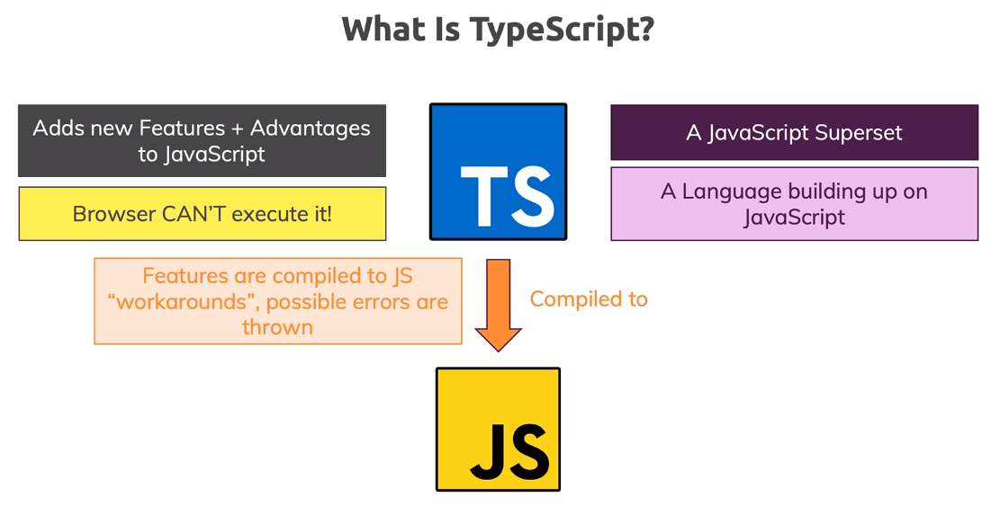
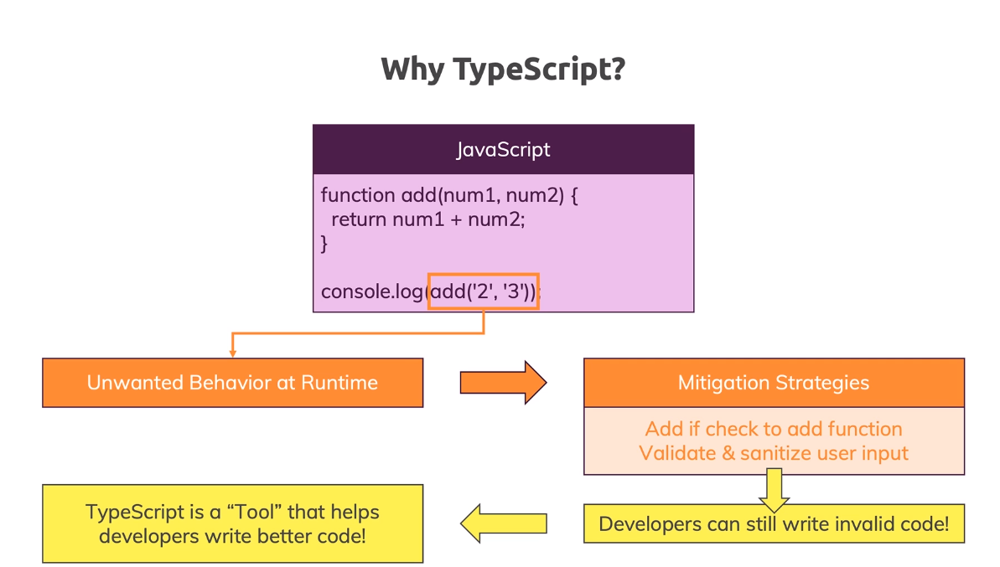

# TypeScript

Typescript is a programming language but it's also a tool, it's a powerful compiler which you run over your code to compile your typescript code to javascript. When you write code in typescript, you get as a result javascript but you dind't write that. Typescript compiling these new features to javascript work arounds. Typescript adds types the reason is that developers have an opportunitty of identifying errors in your code earlier

Typescript is a superset for javascript, typescripts help to write with less errors, better and cleanear code, has new features which don't exist in javacript.

## What is a trasnpiler?

Transpiler is read a source written in one programming language, and produce the equivalent code in other language.

## Basic

### Static Type-Cheking

That's what a static type-cheker type TypeScript does. **Static types system describe the shapes and behaviors of what our values will be**1 when we run our programs. A type-checker like TypeScript uses that information and tells us when things might be **going off the rails**.

### Non-exception Failures

Static type-system has to make the call over what code should be flagged as an error in its system, even if it's **valid** Javascript that won't immediately throw an error.

### Typescript Advantages
