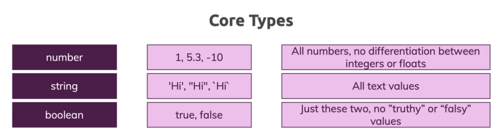

# TypeScript

## Primitives or core Types

In javascript has three very commonly used **primitives**: string, number and boolean. Each has a corrsponding type in **Typescript**. As you migth expect, these are the same names. There is a special type any.

### string

Represents string values like "Hello, world".

### number

Is for numbers like 42. Javascript does not have a special runtime values for integers, so there isn't equivalent to **int** or **float** - everything is simply number.

### boolean

Is for the two values **true** and **false**.

## Object Types

### any

Typescript also has a special type, **any** that you can use whenever you don't want a particular value to cause typechecking errors.
